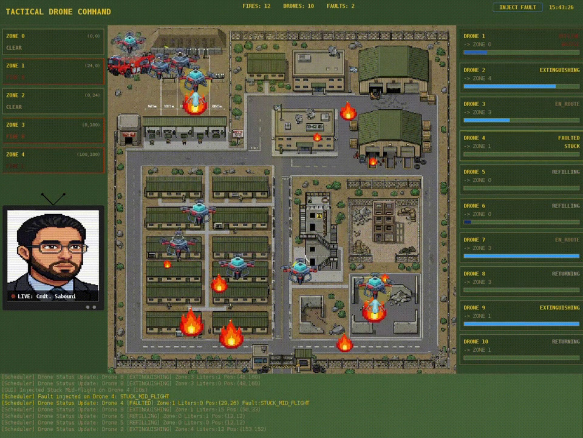
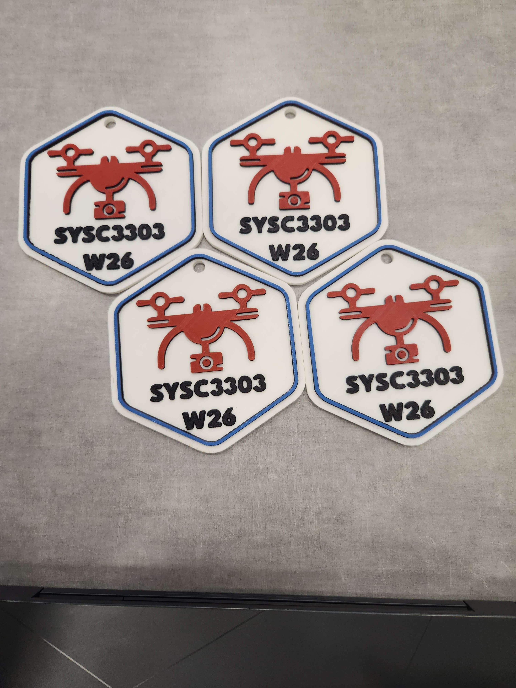
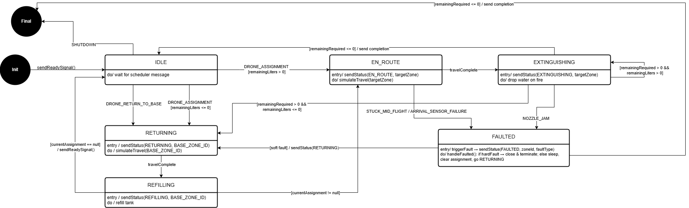
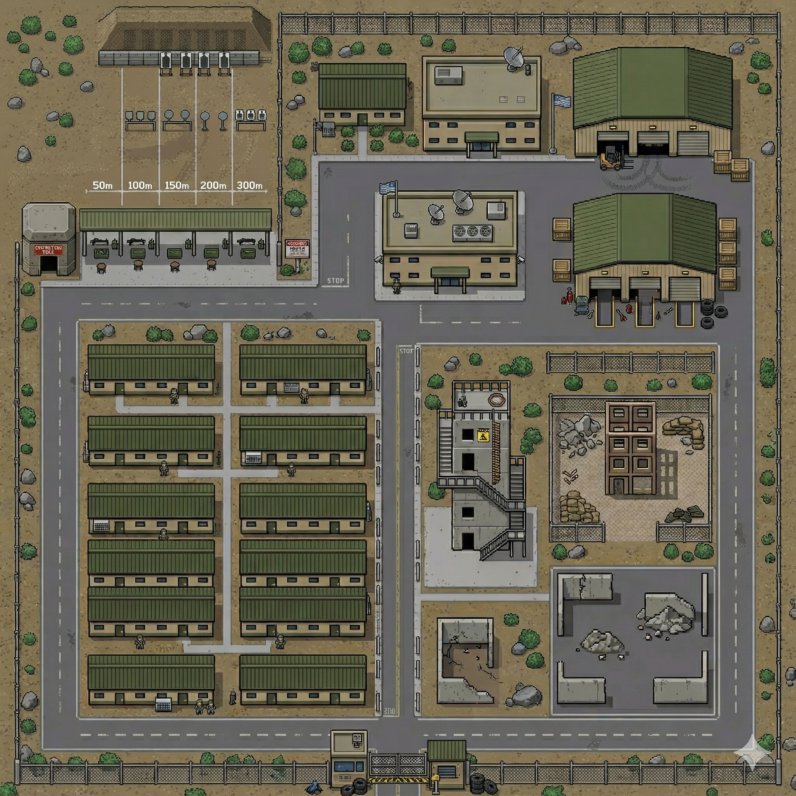
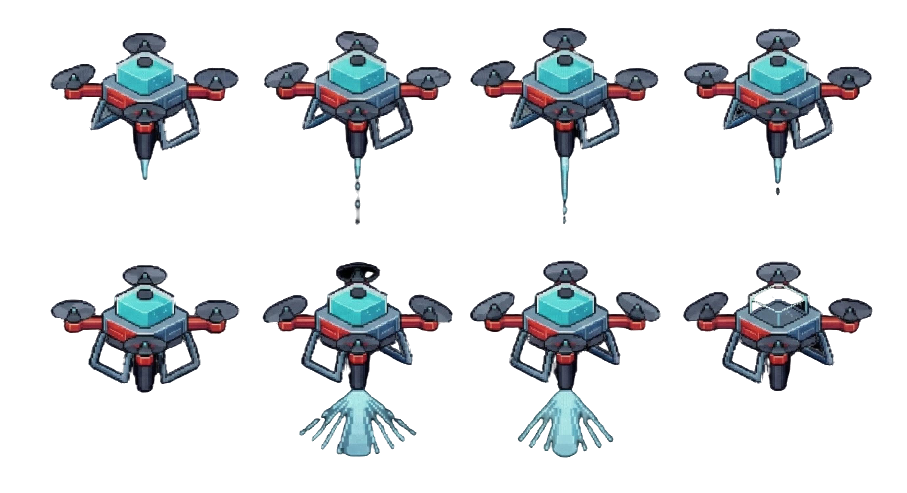
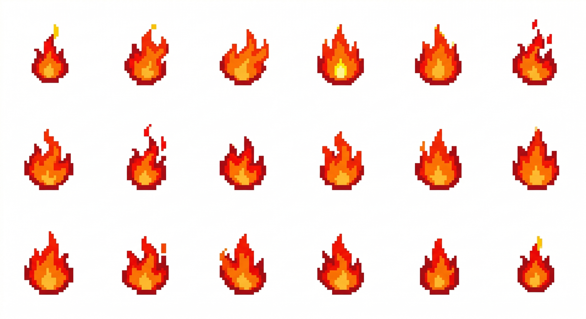
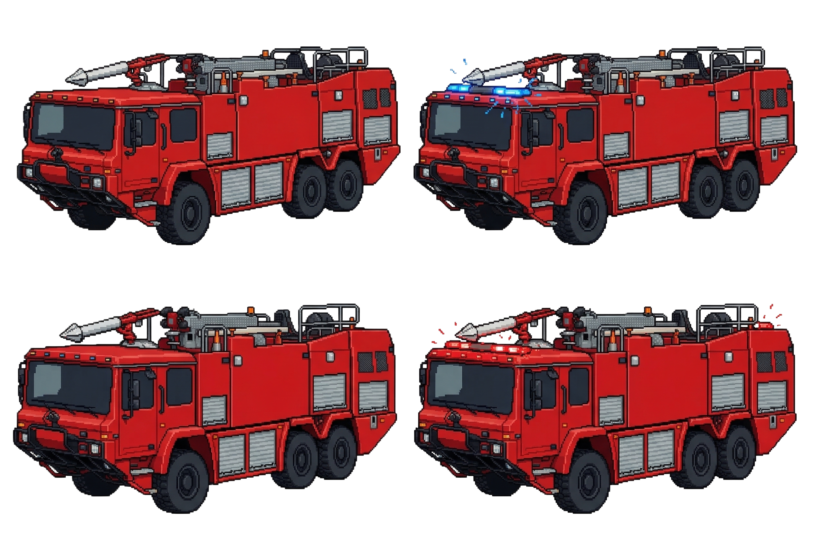
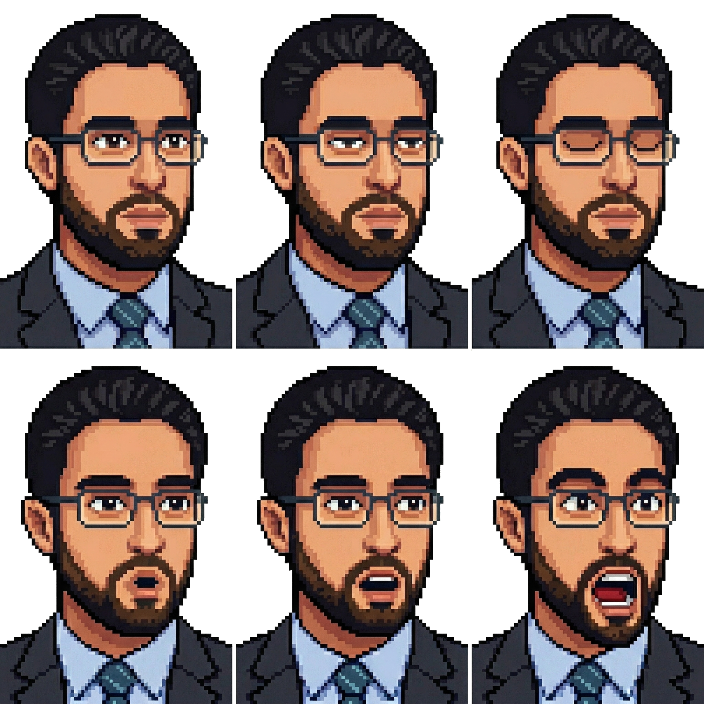

# Firefighting Drone Swarm

A real-time control system and simulator for a swarm of firefighting drones.

**SYSC 3303 · Real-Time Concurrent Systems · Carleton University · Winter 2026**

Course instructor: Dr. Rami Sabouni

### 🏆 Winner of the "Best Design" award

▶ <a href="https://github.com/JowiAoun/SYSC3303W26-Project/blob/gui-competition/assets/demo/SYSC3303-GUI-Submission.mp4">Watch the 36 second demo</a> (drones fly out from base, spray water on the fires, then return to refill)

---

## About

This is a control system and simulator for a swarm of firefighting drones, built for
SYSC 3303 (Real-Time Concurrent Systems) at Carleton University. Drones are dispatched
to put out fires that break out across a set of zones. The work is split into three
programs that run at the same time and talk to each other over the network, the same
way real distributed systems do.

The three parts are:

| Subsystem | Role |
| --- | --- |
| **Fire Incident Subsystem** | Reads a list of fire events (time, zone, type, severity) and reports each one. |
| **Scheduler** | The server, or "brain". Decides which drone or drones to send, tracks every drone, and handles faults. |
| **Drone Subsystem** | Each drone flies to its zone, drops water or foam, refills, and reports its status. Every drone runs its own state machine. |

All three run as separate processes and send messages to each other using UDP
(`DatagramSocket`). The system is configurable: number of drones, number of zones,
travel time between zones, how long a drop takes, and how much agent each drone carries.

---

## 🏆 Best Design

Our team won the **Best Design** award for the final showcase. The judges looked at how
the system was put together and how clearly it presented what the swarm was doing in
real time. As a prize, each team member received a 3D printed token of the class name.

---

## What we learned

The course was about real-time concurrent systems. Building the swarm let us put those
ideas into practice:

- **Concurrency:** running many drones, the scheduler, and the fire reporter at the same
  time without them stepping on each other.
- **Networking:** sending and receiving data over UDP with `DatagramSocket`, and splitting
  the system into separate programs that could run on different computers.
- **Reliable messages:** packing data into packets and using a checksum (CRC32) to catch
  corrupted or lost messages.
- **State machines:** giving each drone clear states (idle, en route, extinguishing,
  returning, refilling, faulted) and clear rules for moving between them.
- **Scheduling:** choosing which drone to send so that every zone gets served, no zone
  waits too long, and the work is shared evenly. A drone with agent to spare can help a
  nearby zone before it returns to base.
- **Real-time behavior:** simulating the time it takes to fly between zones, drop agent,
  take off, and land.
- **Fault handling:** using timers to notice a drone stuck in flight, a jammed nozzle, or
  a failed arrival sensor, then sending the fire to another drone. A jammed nozzle is a
  hard fault that shuts that drone down.
- **Capacity limits:** each drone carries a limited amount of water or foam and must
  return to base to refill.
- **Measurement:** recording how long fires take to put out and how far drones travel, so
  the design can be tuned.
- **Team process:** an iterative build with UML class, state machine, sequence, and timing
  diagrams, plus unit tests at every step.

---

## How it works

A fire event enters through the Fire Incident Subsystem and travels to the Scheduler. The
Scheduler picks the best drone for the zone and sends it an assignment. The drone flies
out, drops its agent, and reports back. If the drone runs low, it returns to base to
refill. If a fault is detected, the Scheduler routes the fire to a different drone.

Every drone follows the same state machine:

The Scheduler can detect and handle these faults, which can also be injected through the
input file to test the system:

- **Stuck mid flight** (the drone never reaches its zone)
- **Nozzle jam** (a hard fault that shuts the drone down)
- **Arrival sensor failure**
- **Corrupted or lost packet**

Full UML class, scheduler state machine, sequence, and timing diagrams are in
[`docs/diagrams`](docs/diagrams).

---

## Inside the simulation

The final display is built to look like a dispatcher's console. It shows a top down map,
drones flying out to fires and spraying them, a fire truck parked at base, and a portrait
of the dispatcher that reacts to how many fires are still burning. Faulty drones are
marked so the operator can spot them at a glance.

| Drones | Fires | Fire truck | Dispatcher |
| :---: | :---: | :---: | :---: |
|  |  |  |  |

---

## Built over five iterations

The system was developed step by step. Each iteration produced a working piece of the
final result.

| Iteration | Focus |
| --- | --- |
| **0** | Collect real drone data (travel time, drop rate, takeoff and landing). |
| **1** | Basic communication: three threads pass messages through the Scheduler, plus a first Swing GUI. |
| **2** | Scheduling and state machines: the core dispatch logic and the drone state machine, with one drone. |
| **3** | Multiple drones and distributed execution: separate programs that talk over UDP. |
| **4** | Fault handling: detect and recover from stuck drones, jammed nozzles, and lost or corrupted packets. |
| **5** | Capacity limits and GUI: refill at base, a real-time dispatcher console, and performance measurements. |

The demo above runs the final setup: **10 drones** across **5 zones**.

---

## Built with

- **Java 21**
- **Swing** with the **FlatLaf** dark theme for the interface
- **UDP** (`DatagramSocket`) for all messages between subsystems
- **JUnit 5** for unit tests
- **Maven** for the build

---

## Team

Team L3G1 (Team 1):

- Zachary Gallant ([@Zach262626](https://github.com/Zach262626))
- Amir Dedeic ([@amirdedeic](https://github.com/amirdedeic))
- Thanos Jia ([@ThanosJia](https://github.com/ThanosJia))
- Jowi Aoun ([@JowiAoun](https://github.com/JowiAoun))

> All four team members approved making this repository public, and the course instructor, Dr. Rami Sabouni, approved it as well.

---

## Documentation

- **[Getting started](docs/getting-started.md)** (build, run, and test)
- **[Project specification](docs/project-specification.pdf)** (the assignment we built to)
- **[Design diagrams](docs/diagrams)** (class, state machine, sequence, and timing)
